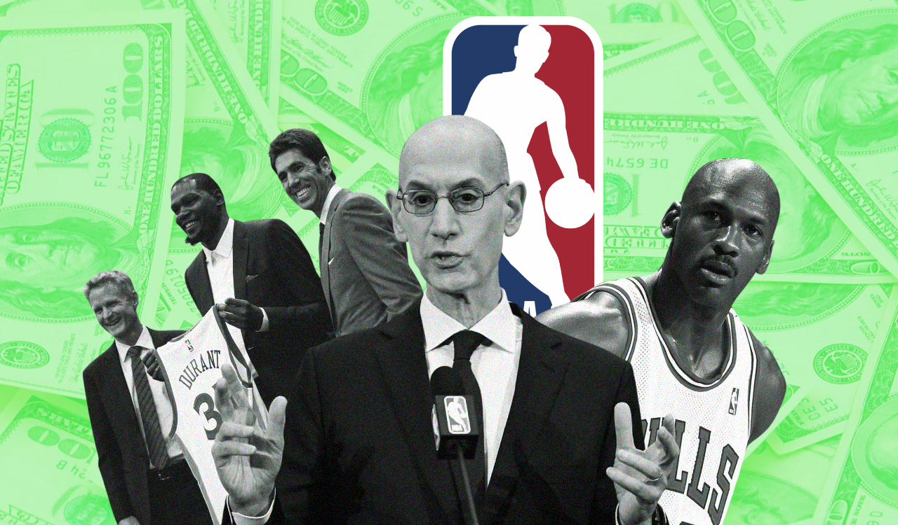

## **Building a salary prediction model to evaluate NBA contracts and identify overvalued and undervalued players.**

The goal of this project was to use machine learning to estimate NBA player market value and evaluate whether players are outperforming or underperforming their contracts. To do so, I built a salary prediction model trained on NBA player statistics and contract data from the post-2016 salary cap era. The model uses performance metrics, advanced statistics, and engineered features to predict a player's expected salary as a percentage of the salary cap. The objective was to explore the relationship between on-court performance and financial value.

**([Check out the full Substack write-up for this project here.](https://packinthepaint.substack.com/p/the-economics-of-basketball))**
